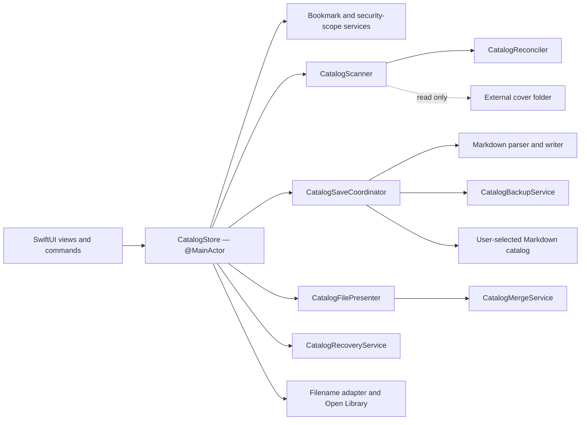

# Vitrine architecture

## 1. Architectural constraints

Vitrine is deliberately a small native application with strict ownership
boundaries:

- one active catalog and one main window;
- one in-memory `CatalogSnapshot` while the application is open;
- one user-selected Markdown file as durable catalog storage;
- one externally managed, read-only cover tree;
- no SwiftData, Core Data, SQLite, CloudKit or hidden catalog database;
- no third-party runtime dependencies;
- Swift strict concurrency, with mutable UI state isolated to the main actor and
  I/O services isolated behind actors.

These constraints are product safety rules, not implementation conveniences.

## 2. Sources of truth

Vitrine has two authority domains.

### Cover-folder authority

The source file controls its relative path, filename-derived title, Finder
Comment, file size, dimensions, dates and current availability. Scanning may
read these values but may not modify the source image or its metadata.

### Markdown authority

The catalog controls stable physical-item UUIDs, bibliographic fields,
provenance, personal notes, record dates, missing-cover decisions and preserved
unknown catalog content.

ISBN is bibliographic data, never item identity. Multiple physical items may
share an ISBN.

## 3. Component overview

`CatalogStore` is the sole main-actor state mutator and workflow orchestrator.
It owns selection, search/filter/sort state, presentation state and the current
snapshot. It delegates parsing, scanning, reconciliation, persistence, network
lookup and recovery rather than implementing those algorithms itself.

`CatalogSaveCoordinator` is the sole active-catalog writer. Other services may
read or prepare values, but they do not replace the live Markdown file directly.

## 4. Core data model

`CatalogSnapshot` contains catalog identity and schema data, folder signature,
ordered `CatalogItem` values, preserved unknown front matter and preserved
unmanaged Markdown text.

Each `CatalogItem` contains:

- a stable UUID;
- `SourceFileMetadata` from the cover tree;
- `BibliographicMetadata` from reviewed/manual/network sources;
- personal notes and record dates;
- current `ItemAvailability`;
- unrecognized record lines preserved for forward compatibility.

The supported Markdown schema remains version 1. New optional fields are added
without changing the schema number when older readers can safely ignore them.
Newer unsupported schemas open read-only.

The writer preserves unknown front matter, unmanaged catalog prose and
unrecognized record lines. This is essential for human editability and forward
compatibility.

## 5. Catalog lifecycle

### Launch and access restoration

1. `CatalogStore.start()` asks `SecurityScopedBookmarkStore` for the last catalog.
2. Bookmark data is refreshed when stale and held through
   `SecurityScopedAccessController` leases.
3. The Markdown file is parsed into a `CatalogSnapshot`.
4. The cover folder is restored independently. If it is unavailable, the
   catalog still opens in metadata-only mode with a non-modal Locate action.
5. `CatalogFilePresenter` begins observing external changes.

Access records live in Application Support as `Vitrine/CatalogAccess.plist`,
keyed by catalog UUID. They include bookmarks, source-folder signature and
volume identity. A remount is accepted by stable volume UUID or resource
identifier, never by display name alone.

### Scanning and reconciliation

`CatalogScanner` enumerates supported images recursively and returns a complete
`CatalogScanResult`; it does not mutate the catalog. It reads bounded metadata
through dedicated services and reports unstable or unreadable files as warnings.

`CatalogReconciler` compares the scan with the current snapshot and returns a
`CatalogReconciliationDiff`. Matching preference is:

1. local file resource identifier;
2. current relative path;
3. portable partial fingerprint;
4. full-content hash when partial fingerprints are ambiguous.

The store applies a diff only if it still matches the current catalog revision.
This prevents an old background scan from overwriting edits made while scanning.

Automatic removal is permitted only after all deletion gates pass: the folder
identity is valid, enumeration completed successfully, no relevant file is
unstable, and rename/fingerprint matching is exhausted. A backup precedes an
automatic removal. Missing or incorrect folders never cause deletion.

`CatalogCoverInformationRebuilder` is distinct from reconciliation: it refreshes
derived file information for existing associations rather than deciding catalog
membership.

## 6. Saving, external changes and conflicts

All logical edits eventually call `CatalogSaveCoordinator.save`. The coordinator:

- serializes writes and collapses overlapping requests;
- renders the complete snapshot through `CatalogMarkdownWriter`;
- coordinates disk access with `NSFileCoordinator`;
- compares the expected content digest with the live file;
- preserves the current file to a local backup before replacement;
- writes atomically;
- establishes a new disk baseline after success.

Backups are stored in Application Support under
`Vitrine/Backups/<catalog UUID>/`. The newest ten are retained.

`CatalogFilePresenter` converts `NSFilePresenter` callbacks into a bounded
`AsyncStream<CatalogFileEvent>`. When another process or Mac changes the file,
the store reads the external version and `CatalogMergeService` performs a
three-way merge using:

- the last disk baseline;
- current in-memory changes;
- the new external snapshot.

Independent field edits merge automatically. Conflicting fields are retained as
`CatalogMergeConflict` values for broad or field-specific user resolution.
Resolution is applied as one undoable catalog mutation; unrelated edits survive
either choice.

## 7. Recovery and maintenance

When normal parsing cannot safely open a catalog, `CatalogRecoveryService`:

1. preserves the damaged bytes in `Vitrine/Damaged Catalogs/`;
2. recovers the catalog UUID from the file or remembered access record;
3. enumerates and validates matching backups;
4. attempts to recover independently readable record blocks;
5. returns immutable recovery choices to the UI.

The user may choose a dated backup, open readable records, or create a new
catalog. Restoration returns through `CatalogSaveCoordinator`, and neither the
damaged original nor selected backup is destroyed.

Maintenance services are intentionally separate:

- `CatalogHealthService` reports readable records, unavailable covers,
  duplicates, damage and backups.
- `CatalogDiagnosticService` exports counts and diagnostic codes while excluding
  identifiers, paths, titles, authors, notes, cover contents, fingerprints and
  checksums.
- `CatalogCoverInformationRebuilder` refreshes cover-derived metadata.

## 8. Metadata integration

Filename parsing is selected-book and user initiated. `FilenameMetadataParser`
returns transient `FilenameMetadataSuggestion` values with confidence, evidence
and source spans. It never writes the catalog.

After field-level review, `FilenameMetadataSuggestionAdapter` maps accepted
values into a copied `CatalogItem`, marks filename or mixed provenance, and hands
the item back to `CatalogStore` for undo registration and coordinated saving.
This adapter is the integration boundary; parser rules do not belong in the
store.

`OpenLibraryService` accepts immutable ISBN or title/author queries. It is an
actor with a one-request-per-second minimum interval, bounded retries and an
in-memory result cache. Candidate fields are presented for comparison and do not
mutate the catalog until accepted. Google and DuckDuckGo are browser fallbacks,
not metadata APIs.

Any new bibliographic field must be added to all of these surfaces in the same
change:

1. model and suggestion/candidate adapters;
2. Markdown parser and writer;
3. search, when user-facing lookup is expected;
4. three-way merge and conflict display;
5. undo snapshots and editor/inspector presentation;
6. English, French and Canadian French localization;
7. accessibility text;
8. old/new catalog compatibility tests.

## 9. UI architecture

`VitrineApp` owns one `CatalogStore` and one main `Window` scene. `ContentView`
switches among welcome, empty, filtered/search-empty and cover-grid states, then
attaches inspectors, alerts and sheets driven by explicit store state.

The cover grid uses `LazyVGrid`, a cached visible-item snapshot per render and
`ScrollViewReader` for stable keyboard-following selection. Artwork cells remain
plain; Liquid Glass is reserved for functional system controls. Book cards expose
selection, grid position, availability and core actions to accessibility.

Durable preferences use `AppStorage`: sort/filter choices, cover size, inspector
and disclosure state, fallback search engine and metadata language. The scene is
single-window by design.

## 10. Concurrency and isolation

- `CatalogStore` and SwiftUI presentation state remain on the main actor.
- Scanning, hashing, image metadata, bookmarks, backups, saving, merging,
  recovery and network lookup use actors or immutable `Sendable` values.
- File-presenter callbacks arrive on a serial `OperationQueue` and cross into the
  application as `Sendable` events.
- Background results are conditional: catalog revision and disk digest checks
  prevent stale work from being applied.
- Cancellation is propagated through refresh and scale-sensitive tasks.

## 11. Verification boundaries

The non-interactive test target covers schema round trips, scanners,
reconciliation, identity, save collapsing, backups, recovery, merging,
localization, metadata integration, cancellation and source hashes.

UI automation is intentionally opt-in because it launches the app and takes
keyboard focus. Fixtures bypass real libraries and native panels while exercising
metadata-only mode, accessibility, keyboard navigation, recovery/conflict entry
points, read-only schemas, single-window behavior and the 5,000-item grid.

See [DEVELOPMENT.md](DEVELOPMENT.md) for commands and
[V1-RELEASE-CHECKLIST.md](V1-RELEASE-CHECKLIST.md) for current release evidence.
