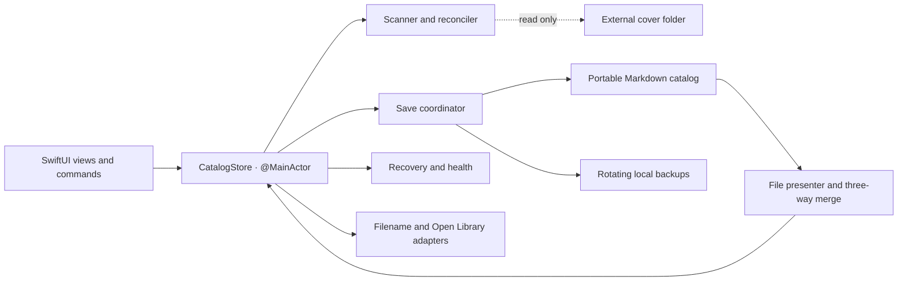

<p align="center">
  
</p>

<h1 align="center">Vitrine</h1>

<p align="center"><strong>A native macOS catalog for physical book collections.</strong></p>
<p align="center">Browse cover artwork, review bibliographic metadata and keep the durable catalog in portable Markdown.</p>
<p align="center"><code>Swift 6</code> · <code>SwiftUI</code> · <code>macOS 26</code> · <code>No third-party runtime dependencies</code></p>

> **V1 release candidate.** The automated unit, integration, concurrency, localization and UI suites pass through 5,000-cover fixtures. Hardware, iCloud, two-Mac, hands-on visual/VoiceOver and distribution-notarization acceptance remain open.

## Product

Vitrine turns a user-selected folder of book-cover images into a fast, visual library without taking ownership of the source files. The cover tree stays externally managed and read-only; bibliographic fields, provenance and personal notes live in one user-selected Markdown catalog.

- Browse JPG, PNG, HEIC, TIFF and WebP covers in a native SwiftUI grid.
- Search, sort, filter, navigate by keyboard, use Quick Look and reveal files in Finder.
- Review filename-derived metadata suggestions field by field, with confidence and evidence.
- Enrich selected records through explicit Open Library lookup or a browser fallback.
- Continue browsing in metadata-only mode when an external cover volume is unavailable.

## Trust and data ownership

| Concern | Vitrine's approach |
| --- | --- |
| **Source-file safety** | Cover files are never copied, renamed, moved, edited, recompressed, deleted or uploaded by Vitrine. |
| **Portable ownership** | The durable catalog is human-readable Markdown rather than a hidden application database. |
| **Explicit network use** | Metadata lookup is user initiated, selected-item only and reviewable before any field is accepted. |
| **Recoverability** | Saves are serialized and atomic, ten rotating backups are retained, and damaged source bytes are preserved during recovery. |
| **External edits** | Disk baselines and three-way merging protect concurrent in-app, Finder, editor and multi-Mac changes. |
| **Privacy-safe support** | Diagnostics exclude paths, identifiers, titles, authors, notes, cover contents, fingerprints and checksums. |

The application uses the macOS App Sandbox, security-scoped bookmarks and stable volume identity. A missing folder, incomplete scan, unstable file or unrelated same-name volume cannot trigger automatic catalog removal.

## Engineering highlights

- **Strict concurrency:** mutable presentation state is isolated to `@MainActor`; scanning, hashing, persistence, recovery and network work use actors or immutable `Sendable` values.
- **Stable physical-item identity:** resource identifiers and relative paths are followed by portable partial fingerprints and full hashes only when ambiguity remains.
- **Defensive reconciliation:** stale background work is rejected by catalog-revision checks, and deletion requires a validated complete scan plus a pre-removal backup.
- **Single-writer persistence:** `CatalogSaveCoordinator` is the only active-catalog writer and coordinates atomic replacement through `NSFileCoordinator`.
- **Conflict-aware editing:** independent external and local field edits merge automatically; genuine conflicts remain explicit and undoable.
- **Forward-compatible Markdown:** unknown front matter, unmanaged prose and unrecognized record lines survive parse/write cycles; unsupported newer schemas open read-only.
- **Human-centred metadata:** suggestions and network results remain transient until the user accepts individual fields.
- **Accessible and localized:** English, French and Canadian French strings, keyboard navigation and macOS accessibility semantics are covered by automated checks.

## Architecture



`CatalogStore` is the sole main-actor catalog mutator. `CatalogSaveCoordinator` is the sole writer of the active Markdown file. Platform access, scanning, reconciliation, persistence, metadata and recovery remain separate services.

## Verification

The normal suite is non-interactive and cannot reopen the remembered personal library. UI automation uses deterministic fixtures and requires explicit confirmation because it launches the app and takes keyboard focus.

| Fixture | Catalog render | Parse/model ready | Refresh | Grid model | Peak resident memory |
| ---: | ---: | ---: | ---: | ---: | ---: |
| 1,000 covers | 529 ms | 1,239 ms | 1,737 ms | 13 ms | 179 MB |
| 2,500 covers | 1,025 ms | 3,063 ms | 4,170 ms | 31 ms | 375 MB |
| 5,000 covers | 2,055 ms | 6,133 ms | 8,343 ms | 62 ms | 666 MB |

The 5,000-item UI navigation test passes its 15-second interaction gate. Before/after SHA-256 manifests remain identical across all scale scans. See the [release-candidate checklist](V1-RELEASE-CHECKLIST.md) for the complete evidence and remaining manual matrix.

## Build and test

**Requirements:** macOS 26, Xcode with the macOS 26 SDK, Swift 6, Apple Development signing, `jq` and `rg`.

```sh
# Build, verify signing and entitlements, then launch
./script/build_and_run.sh --verify

# Run localization, unit, integration, concurrency and integrity checks
./script/test.sh

# Run deterministic UI automation with explicit screen-control consent
./script/test_ui.sh --confirm-screen-control

# Produce release-candidate scale and source-integrity evidence
./script/release_candidate.sh
```

The current artifact is development signed. Developer ID distribution, hardened-runtime packaging and notarization are separate release activities.

## Repository guide

- [`ARCHITECTURE.md`](ARCHITECTURE.md) — ownership boundaries, data flow, persistence, reconciliation and safety invariants.
- [`DEVELOPMENT.md`](DEVELOPMENT.md) — local workflow, tests, localization and release process.
- [`SECURITY.md`](SECURITY.md) — security, privacy and reporting boundaries.
- [`V1-RELEASE-CHECKLIST.md`](V1-RELEASE-CHECKLIST.md) — automated evidence and remaining acceptance work.

```text
Vitrine/
  App/                 App entry point, commands and lifecycle hooks
  Models/              Sendable catalog, metadata and workflow values
  Services/            Access, scanning, Markdown, metadata and recovery
  Stores/              Main-actor application state and orchestration
  Views/               SwiftUI grid, inspector, maintenance and recovery UI
  Resources/           Asset and string catalogs
VitrineTests/          Unit, concurrency, integrity and scale tests
VitrineUITests/        Opt-in macOS UI automation
script/                Build, test, localization and release entry points
```
